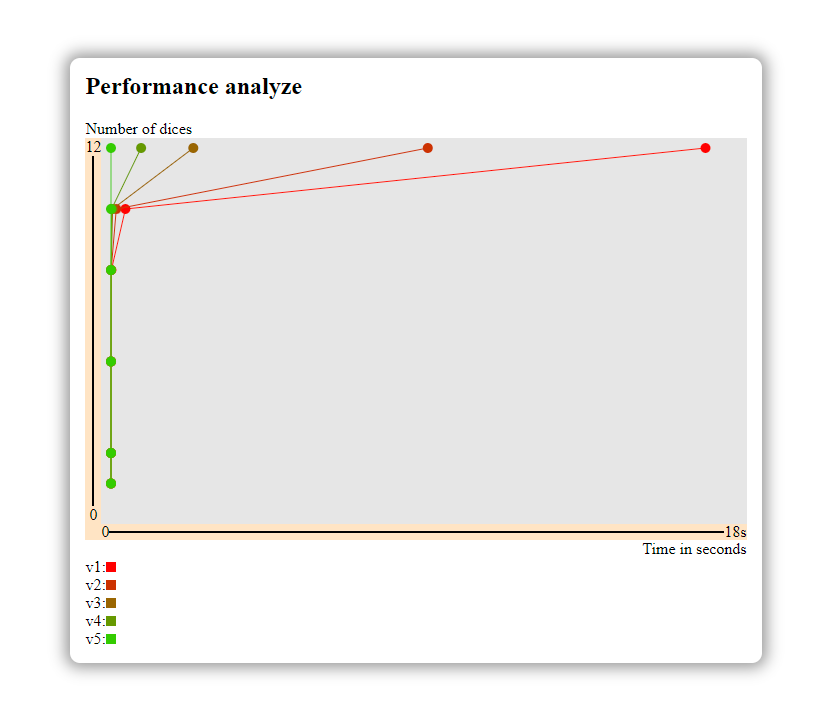

# Usage

You can run all the versions with the following command:
```bash
# install packages if this is the first time
yarn install 

# then you can use the following command
# usage: yarn start <total> <numberOfDices> [numberOfFaces]
yarn start 7 2 6
```

You can also test it with your own code:

```ts
import fastestVersion from './index.ts'

const total = 7
const numberOfDices = 2
const numberOfFace = 6

const result = fastestVersion(total, numberOfDices, numberOfFace)
```

## Previous versions

Alternatively, if you want to try out the other (and slower) versions, you can do so:
```ts
import v1 from './main/src/v1'
import v2 from './main/src/v2'
import v3 from './main/src/v3'
import v4 from './main/src/v4'
import v5 from './main/src/v5'

const versions = [ v1, v2, v3, v4, v5 ]

const total = 7
const numberOfDices = 2
const numberOfFace = 6

// from slowests to fastests versions
versions.forEach(version =>
  console.log('result: ', version(total, numberOfDices, numberOfFace))
)

// from fastests to slowests versions
versions.reverse().forEach(version =>
  console.log('result: ', version(total, numberOfDices, numberOfFace))
)

```

You can time the execution as well:
```ts
const total = 7
const numberOfDices = 2
const numberOfFace = 6

// store start time
const startTime = process.hrtime()

// execute the code
const result = version(total, numberOfDices, numberOfFace)

// get the execution time
const executionTime = process.hrtime(startTime)

// format it in a readable format
const formattedExecutionTime = `(${executionTime[0]}s ${executionTime[1] / 1000000}ms)`

// use it
console.log(`result: ${result} (${formattedExecutionTime})`)
```

Here are some reference performances for each version:

```bash
$> yarn start 28 12 8

[V1] number of possible configurations for a total output of [28] with [12] D8: 12130877 (1562s 762.7643ms)
[V2] number of possible configurations for a total output of [28] with [12] D8: 12130877 (181s 992.145ms)
[V3] number of possible configurations for a total output of [28] with [12] D8: 12130877 (0s 733.3636ms)
[V4] number of possible configurations for a total output of [28] with [12] D8: 12130877 (0s 188.8524ms)
[V5] number of possible configurations for a total output of [28] with [12] D8: 12130877 (0s 0.8651ms)
```

>  *those results are hardware and context dependant, you may not get the same for equivalent workload*

<br />

## Performance Analyze

You can perform your own bulk tests to see how each version performs in different scenarios.

For that, all you have to do is run the command:
```bash
yarn analyze
```

which will run all the tests decribed in the `./performance-analyze/options.analyzer.json` file.

You can edit this file to make it run your own customized tests.
This file is related to a schema, which describe its shape and expected content.

Here's an exemple:
```json
{
    "$schema": "./options.schema.json",
    "options": {
        "baseNumberOfIterations": 3,
        "numberOfFacePerDice": 6,
        "testsToRun": [
            {
                "total": 1,
                "numberOfDices": 1
            },
            {
                "total": 15,
                "numberOfDices": 5
            },
            {
                "total": 25,
                "numberOfDices": 8
            }
        ]
    }
}
```
> Each of those options are described directly when editing the file, thanks to the schema file.

<br />

## Visualize the performance tests results

You can visualize the results of your test directly in your navigator in a graphical way, in order to get a better vision off the all.

For that, all you have to do is run the command:
```bash
# if you are on a unix disto
yarn analyze:unix
# or if you are on windows
yarn analyze:windows
```

This command will open you default browser and show you the results of your tests.

